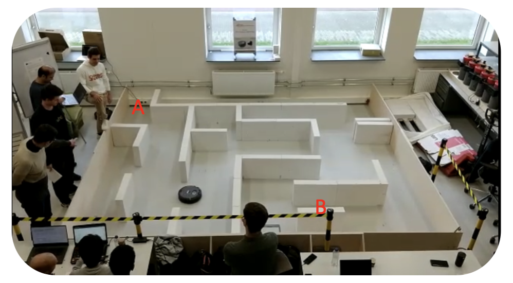
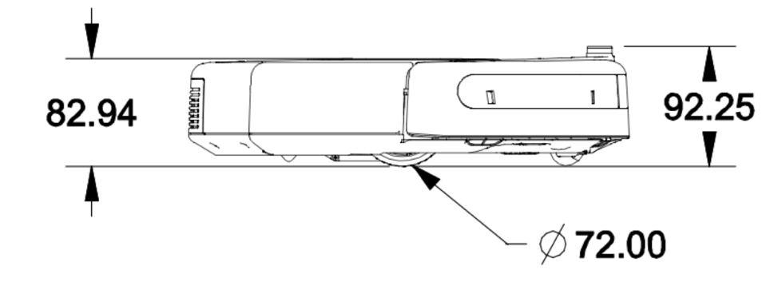

# Autonomous Navigation with iCreate Robot

## Goal

The goal is to program the iCreate Robot (shown in Pic_2.png) using ROS2 to autonomously navigate from Point A to Point B (shown in Pic_1.png) without providing a pre-existing map.

## Visual Representation

### Path to Navigate (Pic_1.png)

### iCreate Robot (Pic_2.png)

## Skills:
- _Software_: ROS2 Library, Python
- _Hardware_: Infrared sensor, IMU, Wheel Encoders 
- _Algorithm_: Wall Follower

## Result – 2 minutes for a robot to reach the Target (Point B).

# Watch the Video
You can watch the video by [clicking here](./Testing_algorithm_1.mp4).

